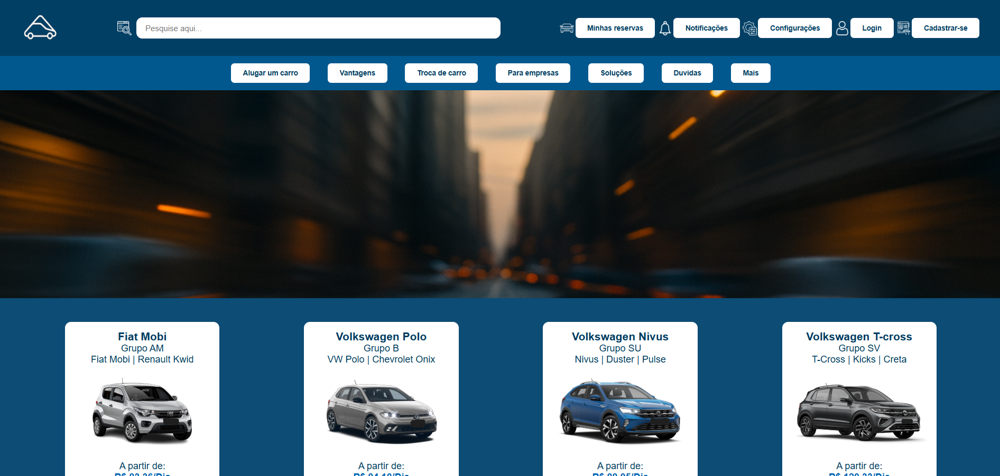
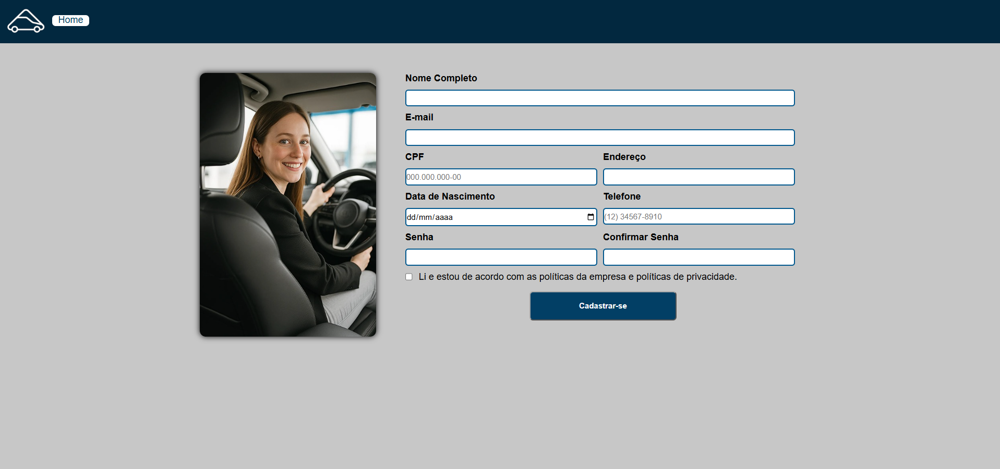

# 🚗 Sistema de Aluguel de Veículos

Sistema web desenvolvido para gerenciamento de aluguel de veículos, permitindo o cadastro de usuários e clientes, autenticação de acesso e integração com banco de dados MySQL por meio do framework **Flask**.

---

## 📖 Sobre o Projeto

Este projeto foi desenvolvido durante a graduação em **Análise e Desenvolvimento de Sistemas** como um trabalho em grupo para a disciplina de desenvolvimento web.

A aplicação foi construída utilizando **Python com Flask** e banco de dados **MySQL**, com o objetivo de simular o funcionamento de um sistema de locação de veículos, incluindo autenticação de usuários, cadastro de clientes e organização da aplicação em camadas.

---

## ✨ Funcionalidades

- Autenticação de usuários (login)
- Cadastro de clientes
- Integração com banco de dados MySQL
- Validação de dados de entrada
- Interface web responsiva utilizando HTML e CSS
- Organização da aplicação em camadas

---

## 🛠️ Tecnologias Utilizadas

### 💻 Backend

- Python
- Flask

### 🗄️ Banco de Dados

- MySQL

### 🎨 Front-end

- HTML5
- CSS3

### 🔧 Ferramentas

- Git
- GitHub

---

## 🏗️ Arquitetura

O projeto foi estruturado de forma organizada, separando a lógica da aplicação, os modelos de dados, os controladores e a interface web.

- **controllers/** → Controladores responsáveis pela lógica das rotas e operações da aplicação
- **models/** → Modelos utilizados para acesso e manipulação dos dados
- **static/** → Arquivos estáticos como CSS e imagens
- **templates/** → Páginas HTML renderizadas pelo Flask
- **app.py** → Inicialização da aplicação Flask
- **conexao.py** → Configuração da conexão com o banco de dados

---

## 📂 Estrutura do Projeto

```text
📦 Aluguel-de-Veiculos
├── controllers/
├── models/
├── static/
│   ├── css
│   └── img
├── templates/
├── app.py
├── conexao.py
├── .env.example
├── .gitignore
└── README.md
```

---

## 🚀 Como Executar

### Pré-requisitos

- Python 3.10+
- MySQL
- Git

### Clone o repositório

```bash
git clone https://github.com/LFFavoretto/sistema-aluguel-veiculos.git
```

### Entre na pasta do projeto

```bash
cd sistema-aluguel-veiculos
```

### Crie um ambiente virtual

```bash
python -m venv .venv
```

### Ative o ambiente virtual

#### Windows

```bash
.venv\Scripts\activate
```

#### Linux/macOS

```bash
source .venv/bin/activate
```

### Instale as dependências

```bash
pip install flask python-dotenv mysql-connector-python
```

### Configure as variáveis de ambiente

Crie um arquivo **`.env`** na raiz do projeto utilizando o arquivo **`.env.example`** como base.

Exemplo:

```env
DB_HOST=localhost
DB_USER=root
DB_PASSWORD=sua_senha
DB_NAME=projeto_alv
SECRET_KEY=sua_chave_secreta
```

### Execute a aplicação

```bash
python app.py
```

A aplicação estará disponível em:

```
http://127.0.0.1:5000
```

---

## 📷 Demonstração

### Tela Inicial



---

### Tela de Login

> 

---

### Tela de Cadastro

> 

---

## 👥 Equipe

Projeto desenvolvido em grupo durante a graduação em **Análise e Desenvolvimento de Sistemas**.

**Integrantes**

- João Pedro
- Lian Marinheiro
- Lucas Ribeiro
- Luiz Favoretto
- Matheus Eduardo

---

## 📄 Licença

Projeto desenvolvido para fins acadêmicos e de portfólio.